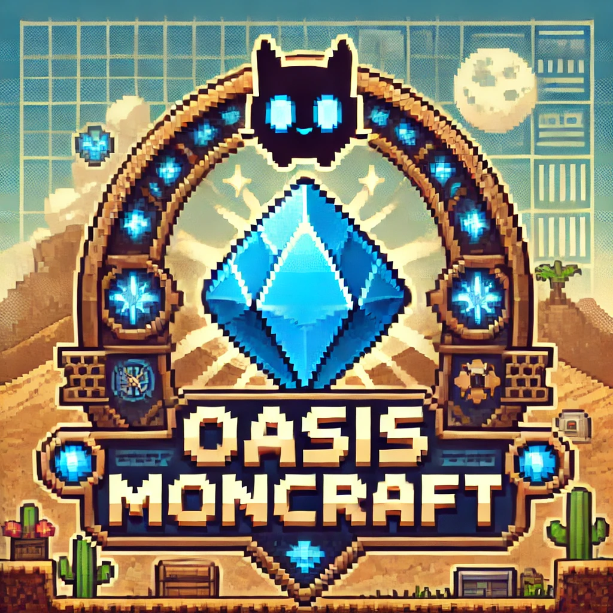
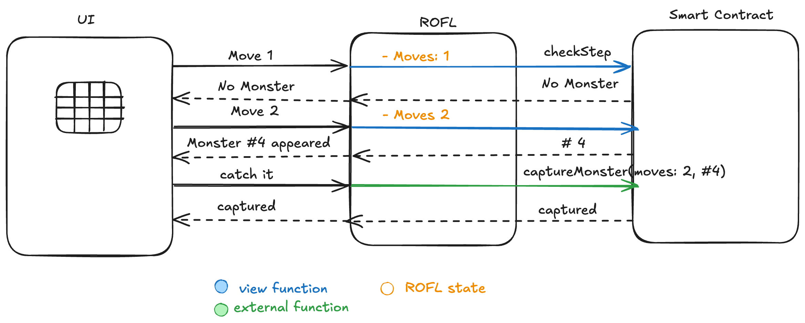

# Oasis MonCraft

## Introduction

**Oasis MonCraft** is a project built for the 2025 ETHDam Hackathon. It’s a retro-inspired, top-down RPG where players explore a grid-based world, encounter wild Monsters, and attempt to catch them — blending on-chain privacy with real-time gameplay.

## Implementation

### Smart Contracts

The game leverages **Oasis Sapphire** and **ROFL** to introduce on-chain privacy and secure randomness into the gameplay, ensuring fairness and decentralization.

### Monster Encounters and Catching Mechanics

The game client connects to a ROFL instance via WebSockets. As the player moves around the grid, ROFL invokes a view function on the `MonCraft` smart contract to determine if a Monster appears. This logic uses secure randomness on Sapphire to make each encounter unpredictable and tamper-proof.

If a Monster appears, the player may choose to attempt a capture. To ensure smooth gameplay, player movement is recorded off-chain in ROFL until the capture is initiated. When a capture is attempted, ROFL sends a transaction to the smart contract, which again uses secure randomness to decide the outcome. If successful, the Monster is added to the player's current session, and the player's state is synchronized on-chain.

Each Monster is represented as an NFT with unique attributes such as HP, attack damage, appearance rates, and capture probabilities.

To prevent abuse (e.g., rerolling movements to force favorable outcomes), player movements are kept off-chain until a decision point, minimizing the attack surface while preserving game feel.

### Game Sessions

To lower the barrier to entry, the game supports **gasless gameplay**: no wallet is required to start. When a session begins, a unique access code is generated, allowing players to return and resume progress later. ROFL signs transactions on behalf of the player during gameplay.

Advanced users can optionally link their wallet and withdraw their Monster NFTs to trade, transfer, or import them into other game sessions.

### Repo structure

- [Frontend](./frontend): Includes the game UI
- [Smart Contracts](./smart-contracts): Includes the Smart Contracts using Hardhat
- [ROFL](./rofl): Includes the Oasis ROFL implementation

